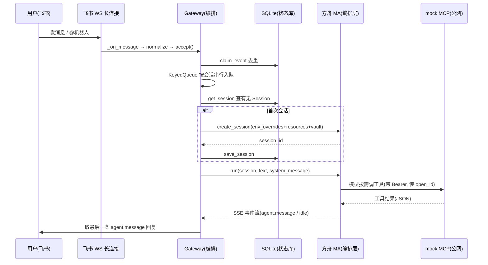
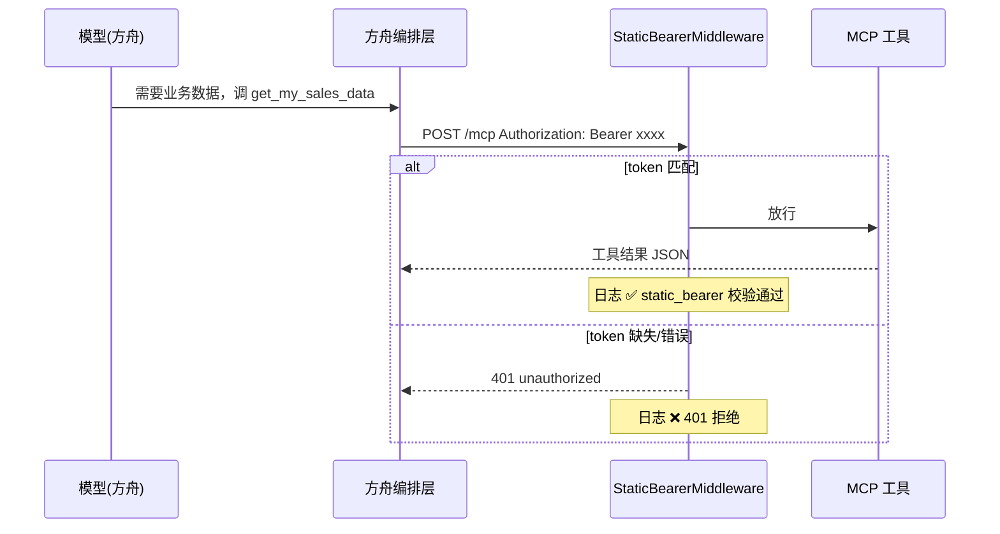
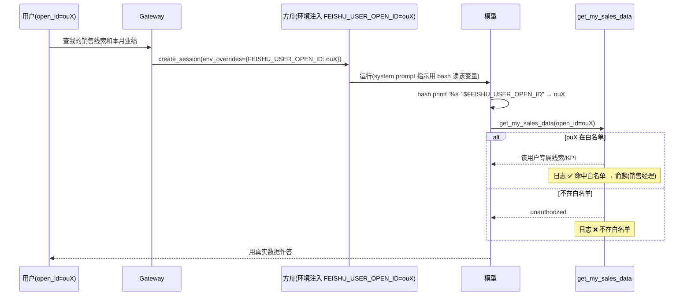
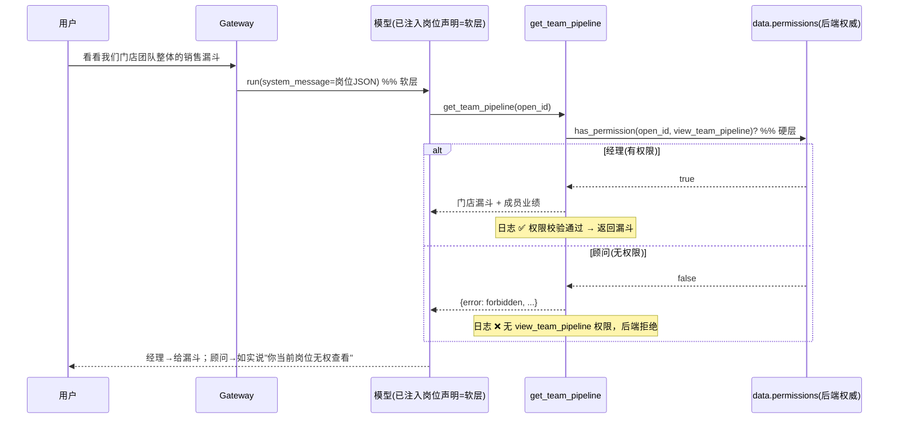
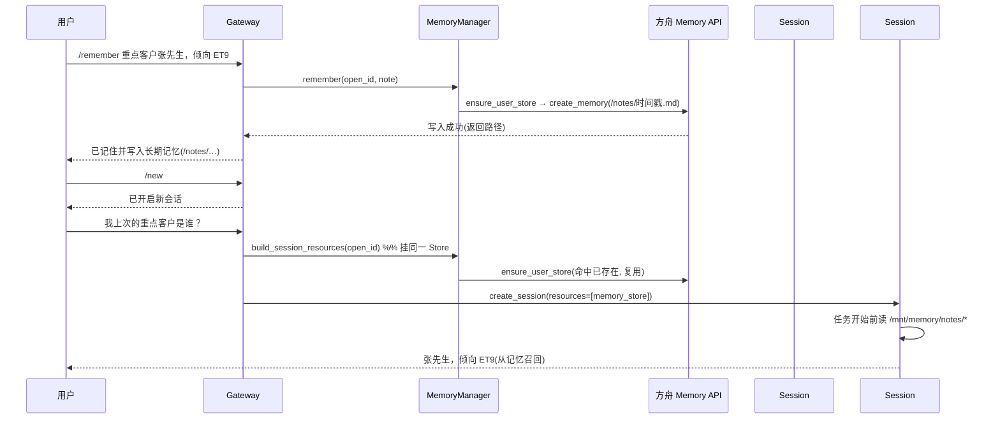

# 客户A MA 迁移 Demo · 四卡点数据流转说明

> 面向：交付 / 二次开发同学。本文逐个拆解 A/B/C/D 四个卡点的**数据流转、Gateway 入口、mock 数据、预期结果**——这是**动态视角**（一条消息怎么流过各组件）。
> 想先搞清"MA 由哪些组件构成、谁绑定谁、何时创建 / 销毁"的**静态视角**，见 [组件关系与生命周期](./MA迁移Demo-组件关系与生命周期.md)。
> 配套代码在本仓库；演示脚本见 [README](../README.md) 的「演示脚本」小节。
> 说明：文中流程图用 Mermaid（`sequenceDiagram`）编写，在支持 Mermaid 的 Markdown 渲染器（Trae/IDE 预览、GitHub）中可直接看图；粘贴到飞书文档时图不渲染，请以图下方的「分步说明」文字为准。

---

## 0. 全局链路：一条消息怎么从飞书走到方舟

四个卡点都挂在同一条主链路上，先把骨架看清，后面每个卡点只讲它在哪一环加了什么。



**分步说明（对应代码入口）**

| 步骤 | 做什么 | 代码入口 |
| --- | --- | --- |
| 1 | 飞书 WS 收到消息，回调里归一化成 `IncomingMessage` | [feishu.py `_on_message`](../arkagent/feishu.py#L117-L122)、[normalize_feishu_message](../arkagent/feishu.py#L30-L58) |
| 2 | 同步入口：过滤（群聊需 @）+ 事件去重 + 投递到事件循环 | [gateway.py `accept`](../arkagent/gateway.py#L88-L112)、[should_handle_message](../arkagent/gateway.py#L238-L241) |
| 3 | 按「会话四元组」串行化，同会话顺序处理、跨会话并行 | [KeyedQueue](../arkagent/gateway.py#L27-L52)、[to_conversation_key](../arkagent/gateway.py#L244-L250) |
| 4 | 主处理：鉴权 → 指令分发 → 建/复用 Session → run → 回执 | [gateway.py `_process`](../arkagent/gateway.py#L123-L172) |
| 5 | 首次建 Session（这里注入卡点 B/C/D 的三样东西） | [gateway.py `_create_session`](../arkagent/gateway.py#L174-L187) |
| 6 | 驱动方舟 Session 跑一轮，解析 SSE，取最后一条回复 | [ark.py `run`](../arkagent/ark.py#L261-L301)、[result_to_reply](../arkagent/gateway.py#L253-L259) |

**会话隔离键（关键）**：会话 = `(tenant_key, chat_id, thread_id, user_open_id)` 四元组（[to_conversation_key](../arkagent/gateway.py#L244-L250)）。因为含 `user_open_id`，**群聊里不同人天然是不同 Session**；单聊里每个人也各自独立。`/new` 只重置当前这一条会话（[reset_session](../arkagent/store.py#L108-L114)）。

---

## 0.5 关键机制深挖 · 凭证与 OpenID 的存储与传递

演示前先把两个最容易被问到的机制吃透：**卡点 A 的 static Bearer 凭证**、**卡点 B 的 OpenID**。它俩是两条完全不同的链路（一条走传输层、一条走应用层），下面按"是什么 / 给谁用 / 怎么存 / 怎么传 / 怎么验证"逐条说清。

### 一、`MCP_STATIC_BEARER` 到底是什么？凭证给谁用？

- **它是什么**：一个**你自己定的固定字符串密码**（demo 用 `demo-bearer-token`），充当"**方舟客户端**访问 mock MCP 的门禁口令"。它**不是**飞书 token、**不是**某个用户的身份、**不是** 客户A 私有签名——就是一把静态的对称密钥。
- **给谁用**：代表"**方舟编排层这个调用方**"去敲 mock MCP 的门。和"哪个飞书用户在对话"无关——不管张三李四发消息，方舟连这台 MCP 用的都是**同一个** Bearer token。（区分"是哪个用户"是卡点 B 的 openid 干的事，不是这个 token。）
- **一处配、两处用**（两边必须一致，否则 401）：
  | 位置 | 角色 | 代码 |
  | --- | --- | --- |
  | 启动 mock 时 `MCP_STATIC_BEARER=demo-bearer-token` | **服务端**：middleware 拿它当"正确答案"逐请求比对 | [StaticBearerMiddleware](../mock_mcp/server.py#L98-L125) |
  | init/换址时写入方舟 Vault 凭据的 `token` 字段 | **客户端**：方舟连 MCP 时用它拼 `Authorization` 头 | [create_static_bearer_credential](../arkagent/ark.py#L188-L198) |

### 二、这个凭证在 MA 系统里怎么存？（Vault → Credential）

方舟侧不是把 token 散在 Agent 定义里，而是有一套**独立的密钥保管结构**：

```text
Vault（金库，本 demo 一个）
  └── Credential（凭据，名叫 customer-a-mcp-static-bearer）
        auth.type          = "static_bearer"
        auth.mcp_server_url = https://<公网地址>/mcp   ← 这把钥匙配哪扇门（结构性字段，创建后锁定）
        auth.token          = demo-bearer-token         ← 敲门口令（方舟加密保管，API 不回显明文）
```

- **谁把它交给运行时**：建 Session 时传 `vault_ids=[vault_id]`（[gateway.py:184](../arkagent/gateway.py#L184)），等于告诉这次会话"能用这个金库里的钥匙"。
- **方舟怎么用它**：运行时方舟要连 Agent 定义里的 `mcp_servers[].url`，就去挂到本 Session 的 Vault 里，**按 `mcp_server_url` 匹配**找到对应 Credential，取出 token 自动拼 `Authorization: Bearer <token>` 发出去。**匹配是按 URL 的**——这也是"换 cpolar 地址后必须重建凭据"的根因：凭据 URL 若还指向旧址，方舟按新址找不到匹配凭据 → 干脆匿名连接（不带头）→ mock 打 `auth=<缺失> 401`。
- **`mcp_server_url` 创建后不可改**：它是结构性字段，换地址只能"删旧建新"（[delete_credential](../arkagent/ark.py#L200-L206) 注释 + `arkagent update-agent --mcp-url` 已封装这套删建）。

### 三、怎么验证这个凭证真的在起作用？

三个层次，从强到弱：

1. **建凭据这一步就是一次线上验证**：方舟创建 static_bearer 凭据时会**立即握手探测** MCP（带上 token 发一次 initialize）。token 错 → 直接 `401 MCPInvalidCredential`；地址不可达 → `424`。所以 `arkagent init` / `update-agent --mcp-url` **不报错** = 方舟公网能连上且 token 校验已通过。
2. **mock 日志逐请求留证**（最直接）：每个入站请求打一行掩码日志——
   ```text
   [MCP] POST /mcp  auth=Bearer demo…oken  ✅ static_bearer 校验通过
   ```
   看到 `✅` 且 `auth=Bearer …` 有值 = 凭证在用且正确；看到 `auth=<缺失>` = 方舟没带头（凭据 URL 不匹配）；看到 `❌ token 不匹配` = 带了但值不对。
3. **反证**：故意把 mock 的 `MCP_STATIC_BEARER` 改成别的值重启（不动方舟凭据）→ 再问业务数据 → mock 打 `❌ 401 拒绝`、模型侧工具失败。能复现"改坏就断" = 证明这道门禁真的在拦。

### 四、OpenID 在数据流里怎么存、怎么传？

先记住一句：**OpenID 全程不走 HTTP 传输层**（传输层只有卡点 A 的 Bearer 头），它是**应用层数据**，一路当"值"被搬运，最后由**模型主动读出、当工具入参填进去**。逐跳看它"住在哪"：

| 跳 | OpenID 以什么形态存在 | 代码 |
| --- | --- | --- |
| ① 飞书事件 | 事件体 `sender.sender_id.open_id`（对话用户，非 bot） | [normalize_feishu_message](../arkagent/feishu.py#L45-L54) |
| ② Gateway 内存 | 归一化成 `IncomingMessage.user_open_id`，并作为**会话四元组的一段**参与 Session 隔离 | [to_conversation_key](../arkagent/gateway.py#L244-L250) |
| ③ 建 Session（关键一跳） | 作为**会话级环境变量** `FEISHU_USER_OPEN_ID` 注入方舟运行环境 | [gateway.py:185](../arkagent/gateway.py#L185) |
| ④ 方舟环境 | 经 `environment_with_overrides` 合并进 Environment 的 `env`，成为沙箱里的一个环境变量 | [ark.py create_session:235-243](../arkagent/ark.py#L235-L243) |
| ⑤ 模型运行时 | 模型按 system prompt 指示，用 `bash printf '%s' "$FEISHU_USER_OPEN_ID"` **读出它的值** | [init.py:27](../arkagent/init.py#L27) |
| ⑥ 调工具 | 模型把读到的值作为 JSON 入参 `get_my_sales_data(open_id="ou…")` 填入 | 模型行为（受 prompt 约束） |
| ⑦ MCP 侧 | 工具函数拿到 `open_id` 参数，查白名单/权限、返回该用户专属数据 | [get_my_sales_data](../mock_mcp/server.py#L52-L61) |

> **两个要点**：
> - **为什么不落库、每 Session 一注入**：openid 属于"这次对话是谁"，随 Session 创建当场注入即可；它已进了会话四元组做隔离，无需额外持久化。（对比：卡点 C 的岗位、D 的 store 映射才需要落 SQLite。）
> - **为什么模型是链路的一环**：openid 不是框架自动塞进工具的，是**模型读环境变量→自己填参数**。所以这条链依赖模型执行 bash——这正是历史上"bash 抢戏"坑的由来（模型可能拿 bash 去沙箱瞎找 MCP 而不直接调工具），已靠 system prompt 强约束修正（[init.py:44](../arkagent/init.py#L44)）。

---

## 卡点 A · static_bearer 鉴权 + 模型直调 MCP

### 一句话
给 MCP 加一道 `Authorization: Bearer <token>` 门禁；方舟编排层调 MCP 时自动带上凭据里的 token，mock 校验通过才返回数据。**这是"安全降级"演示，不是 客户A 私有签名**。

### Gateway 入口
Gateway 本身对 A **不做特殊处理**，只在建 Session 时把 `vault_id` 传下去——凭据存在 Vault 里，方舟编排层调 MCP 时自动附加 Bearer。

- 凭据在 **init 阶段**创建：[init.py:123-132](../arkagent/init.py#L123-L132) → [create_static_bearer_credential](../arkagent/ark.py#L188-L198)（创建时方舟会**握手探测** MCP，不可达直接 4xx）。
- 运行时透传 vault：[gateway.py `_create_session`:184](../arkagent/gateway.py#L184)（`vault_ids=[vault_id]`）。
- 服务端校验：[StaticBearerMiddleware](../mock_mcp/server.py#L98-L125)。

### mock 了哪些数据
不涉及业务数据，只涉及**一个 token**：
- token 来源：启动 mock 时的环境变量 `MCP_STATIC_BEARER`（README 示例用 `demo-bearer-token`）。
- 中间件逐请求比对 `Authorization` 头是否等于 `Bearer <token>`，并打**掩码日志**（[mask_token](../mock_mcp/server.py#L33-L39)，只露头尾各 4 位）。

### 数据流转



### 预期结果
- **必须问"只能从 MCP 取到"的数据**（如"查我的销售线索和本月业绩"）才能逼模型真正调工具。别用"ET9 续航"——模型用自带知识直接答，不会调 MCP，看不到鉴权链路。
- mock 日志出现：
  ```text
  [MCP] POST /mcp  auth=Bearer demo…oken  ✅ static_bearer 校验通过
  ... CallToolRequest ...
  ```
- 若凭据 token 与 mock 不一致 → mock 打 `❌ 401 拒绝` → 方舟侧工具失败。

> **踩坑提醒**（见 [README 避坑](../README.md#L115-L117)）：MCP 地址末尾不要带 `/`（`/mcp/` 会 307，方舟握手不跟随 → 424）；mock 已关闭 FastMCP 的 DNS-rebinding 保护（否则经穿透访问返回 421）。

---

## 卡点 B · OpenID 透传（按用户隔离数据）

### 一句话
把**对话用户（不是 Bot）**的飞书 `open_id`，经"会话级环境变量"注入到方舟运行环境；Agent 用 bash 读出它、作为入参传给 MCP 工具，MCP 按 `open_id` 返回该用户专属数据。

> **关键区分**：`open_id` **不走传输层**（HTTP 头里只有卡点 A 的 Bearer token），它是**应用层数据**——由模型从环境变量读出后，作为工具调用的 JSON 参数 `get_my_sales_data(open_id=…)` 填进去。因此这条链路依赖模型主动执行 bash 去读，模型本身是链路的一环（这也是"bash 抢戏"坑的根源）。

### Gateway 入口
- 建 Session 时注入环境变量：[gateway.py `_create_session`:185](../arkagent/gateway.py#L185)
  ```python
  env_overrides={"FEISHU_USER_OPEN_ID": message.user_open_id}
  ```
- 底层组装 `environment_with_overrides`（把 override 合并进 Environment 的 env）：[ark.py `create_session`:227-235](../arkagent/ark.py#L227-L235)。
- Agent 侧读取与使用规则写在 system prompt：[init.py:27](../arkagent/init.py#L27)（用 `printf '%s' "$FEISHU_USER_OPEN_ID"` 读，再传给工具）。
- `open_id` 从消息事件解析：[feishu.py:46-54](../arkagent/feishu.py#L46-L54)（`sender.sender_id.open_id`）。

### mock 了哪些数据
按 `open_id` 分桶的用户数据表 [USER_DATA](../mock_mcp/data.py#L14-L50)：

| open_id | 姓名 | 岗位 | 线索(leads) | KPI |
| --- | --- | --- | --- | --- |
| `ou_237bfabd…3017`（真机 demo 账号） | 俞麟 | 销售经理 | 周先生/ET9、吴女士/ES6、郑先生/ET5 | 31/45，团队 9 人 |
| `ou-demo-manager` | 王经理 | 销售经理 | 张先生/ET9、陈女士/ES6 | 27/40，团队 8 人 |
| `ou-demo-sales` | 李顾问 | 销售顾问 | 张先生/ET9、刘先生/ET5 | 4/6 |

工具：[get_my_sales_data(open_id)](../mock_mcp/server.py#L52-L61)——白名单命中返回数据桶，未命中返回 `unauthorized`。

### 数据流转



### 预期结果
- 同一句话，**不同飞书账号拿到不同数据**（用两个账号对比最直观：各自的线索/KPI 不同 = 隔离成立）。
- mock 日志打**完整 open_id**（open_id 非密钥，故不掩码）：
  ```text
  [MCP] 工具 get_my_sales_data  open_id=ou_237bfabd…3017  ✅ 命中白名单 → 俞麟（销售经理）
  ```
- **真机首次会被拒**：你的真实 open_id 默认不在 [USER_DATA](../mock_mcp/data.py#L14-L50)。看日志拿到你的 open_id，加进白名单、重启 mock（纯本地改动，无需重跑 init）后再问即可。这条"被拒"本身也证明 open_id 已正确透传。

> 说明：卡点 A 与 B 常一句话一起演示——"查我的销售线索和本月业绩"既触发了 Bearer 鉴权（A），又触发了 open_id 透传（B）。

---

## 卡点 C · 岗位信息注入（软层话术 + 硬层权限）

### 一句话
岗位信息分**两层**：
- **软层**（话术/口径）：把岗位 JSON 注入 `system.message`，影响模型的表达与判断；`/role` 可即时改，Session 不变。
- **硬层**（真权限）：敏感数据（团队漏斗）由 **MCP 后端按权威 permissions 真校验**，`/role` 改不动——顾问账号问漏斗一定被 `forbidden` 拒。

两层不可混淆：软层是"模型自觉"，硬层是"后端强制"。安全数据必须靠硬层。

### Gateway 入口（软层）
- 每 session 只注入一次岗位声明：[gateway.py:159-162](../arkagent/gateway.py#L159-L162) → [RoleManager.system_message_for](../arkagent/role.py#L77-L84)。
- 注入内容拼装：[build_role_system_message](../arkagent/role.py#L47-L49)（`【当前用户岗位信息】{json}` + 判定规则）。
- `/role` 指令改岗位：[gateway.py `_handle_role_command`:211-225](../arkagent/gateway.py#L211-L225) → [on_role_change](../arkagent/role.py#L86-L88)（更新缓存 + 清 `injected_for_session` → 下一轮强制重注入）。
- `/whoami` 看当前缓存岗位：[gateway.py `_describe_role`:227-231](../arkagent/gateway.py#L227-L231)。
- 岗位缓存与 TTL（24h）：[ensure_fresh_role](../arkagent/role.py#L67-L75)、缓存表 [role_cache](../arkagent/store.py#L62-L67)。

### Gateway 入口（硬层）
硬层**不在 Gateway**，在 MCP 后端：[get_team_pipeline(open_id)](../mock_mcp/server.py#L72-L93) 三层校验：白名单 → `view_team_pipeline` 权限位 → 返回漏斗。Gateway 只负责把 open_id 透传（同卡点 B）。

### 软层岗位的生命周期（`/role` 到底改了什么）
理解这一节才能正确演示"顾问 → 经理"的切换：

- **初始岗位从哪来**：软层岗位不是写死的。首次收到某 open_id 的消息时，由 [mock_hr_provider](../arkagent/role.py#L91-L100) 按 open_id **后缀**决定 —— `…manager` → 销售经理、`…sales` → 销售顾问、**其余一律默认「销售顾问」**。真机 demo 账号 `ou_237bfabd…3017` 不含这两个后缀，故**初始就是销售顾问**。
- **岗位存在哪**：写进 SQLite 的 [role_cache](../arkagent/store.py#L62-L67) 表（落在 `gateway.db` 文件里），带 `refreshed_at` 时间戳。**持久化 —— 重启 Gateway 也不丢**。
- **`/role` 改的是缓存、不是 HR 源**：[on_role_change](../arkagent/role.py#L86-L88) 把新岗位 upsert 进 `role_cache`、刷新 `refreshed_at`、清空 `injected_for_session`。此后每轮 [ensure_fresh_role](../arkagent/role.py#L67-L75) 判 `now - refreshed_at > 24h TTL`？**未过期就一直返回缓存里的岗位**。
- **结论**：一旦 `/role 销售经理`，就会**一直是销售经理**，直到满足以下任一条件才变——① 满 24h TTL 自动回 HR（默认账号又变回销售顾问）；② 再手动发一次 `/role`。
- **`/new` 不会重置岗位**：[reset_session](../arkagent/store.py#L108-L118) 只 `DELETE FROM conversations`（会话映射），**不碰 `role_cache`**。这是有意为之——岗位属于用户身份，不应随开新会话丢失。

**岗位状态转移表：**

| 触发 | 岗位缓存变化 | 说明 |
| --- | --- | --- |
| 首次对话 | → HR 初始值 | 默认账号 = 销售顾问 |
| `/role 销售经理/…` | → 销售经理 | 清 `injected_for_session` → 下一轮重注入，**Session 不变** |
| 后续对话（< 24h） | 保持销售经理 | 未过期，直接读缓存 |
| 重启 Gateway | 保持 | `role_cache` 持久化在 `gateway.db` |
| `/new` | 保持 | 只删会话映射，不碰岗位 |
| 满 24h TTL | 重新拉 HR → 销售顾问 | 自动回退 |

> ⚠️ **演示前置**：要演示出"顾问 → 经理"的**变化**，得先确保当前是**销售顾问**。若上次演示已 `/role` 成经理且未过 24h，请先发 `/role 销售顾问/上海浦东蔚来中心` 回退（**务必带门店**，否则门店会被填成「未知门店」），再用 `/whoami` 确认已回到销售顾问，然后开始正式演示。

### mock 了哪些数据
- 后端权威权限位：[USER_DATA[*].permissions](../mock_mcp/data.py#L14-L50)（经理=`view_own_leads`+`view_team_pipeline`+`approve_discount`；顾问=仅 `view_own_leads`），常量定义见 [data.py:8-10](../mock_mcp/data.py#L8-L10)。
- 门店级团队漏斗 [TEAM_PIPELINE](../mock_mcp/data.py#L53-L71)（上海浦东蔚来中心：线索 128 → 到店 76 → 试驾 52 → 下定 31 → 交付 24 + 三成员业绩）。
- 校验辅助：[has_permission](../mock_mcp/data.py#L89-L92)、[get_team_pipeline_for_store](../mock_mcp/data.py#L95-L96)。
- 演示用 HR（软层岗位来源）：[mock_hr_provider](../arkagent/role.py#L91-L100)（按 open_id 后缀 `manager`/`sales` 返回不同岗位与 permissions）。

### 数据流转（硬层是重点）



### 预期结果
- **软层演示**：`/whoami` 看当前岗位 → `/role 销售经理/上海浦东蔚来中心` → 再问审批口径/话术，观察回答按新岗位变化，且 **Session 不变**（不新建 Session）。回执："已更新岗位为「销售经理」，下一轮对话会自动向 Agent 声明新岗位"。
- **硬层演示**：
  - **经理账号**（`ou-demo-manager` 或俞麟）问漏斗 → 返回真实漏斗，日志 `✅ 权限校验通过`。
  - **顾问账号**（`ou-demo-sales`）问漏斗 → 返回 `forbidden`，模型如实回"你当前岗位无权查看该数据"（system prompt 已约束不许伪造，见 [init.py:43](../arkagent/init.py#L43)），日志 `❌ 无 view_team_pipeline 权限，后端拒绝`。
- **关键边界**：即使用顾问账号 `/role 销售经理` 把软层改成经理，**硬层仍拒**——因为后端认的是该 open_id 在 [USER_DATA](../mock_mcp/data.py#L14-L50) 里的真实 permissions，不认对话层声称的岗位。这正是"安全正确"的体现。

---

## 卡点 D · 跨 Session 记忆延续（读挂载 + 写回）

### 一句话
每个用户一个专属 Memory Store，建 Session 时以 `resources` **只读挂载**到 `/mnt/memory/`；写记忆走 `/remember` 显式指令，由**应用侧调 API** 写回（方舟不自动抽取记忆、Agent 对 memory 只读）。`/new` 后新 Session 挂同一 Store，即可读到之前写入的笔记。

### Gateway 入口
**读链路**
- 建 Session 时挂载 Store：[gateway.py `_create_session`:179-186](../arkagent/gateway.py#L179-L186) → [MemoryManager.build_session_resources](../arkagent/memory.py#L78-L89)。
- 首访建 Store + 预置画像：[ensure_user_store](../arkagent/memory.py#L33-L52)（首次写 `/profile/basic.md` 岗位画像）。
- Agent 读取规则：[init.py:36](../arkagent/init.py#L36)（任务开始前先读 `/mnt/memory/` 下画像与笔记；记忆只读）。

**写链路**
- `/remember <内容>` 指令：[gateway.py `_handle_remember_command`:189-209](../arkagent/gateway.py#L189-L209) → [MemoryManager.remember](../arkagent/memory.py#L54-L64)。
- 落库 API：[ark.py `create_memory`:205-210](../arkagent/ark.py#L205-L210)（`POST /memory_stores/{id}/memories`），路径 `/notes/<时间戳>.md`。

**`/new` 重置**：[gateway.py:132-136](../arkagent/gateway.py#L132-L136) → [reset_session](../arkagent/store.py#L108-L114)（只删会话映射，**不删 Store**）。

**Store 映射持久化**：[memory_stores 表](../arkagent/store.py#L184-L202)（open_id → store_id，保证同一用户每次挂同一个 Store）。

### mock 了哪些数据
卡点 D **不经过 mock MCP**——它直接用方舟的 Memory Store API。涉及的"数据"是：
- 首次预置的用户画像：`/profile/basic.md`（岗位 + 门店，来自 [ensure_user_store](../arkagent/memory.py#L45-L50)）。
- `/remember` 写入的笔记：`/notes/<YYYYMMDD-HHMMSS>.md`，内容是用户指定文本（用时间戳命名避免同路径不覆盖——Store 的 create 语义是"路径已存在则不覆盖"）。

### 数据流转



### 预期结果
- 正确演示脚本（**必须用 `/remember`，不能用自然语言"记住…"**）：
  ```text
  /remember 我负责的重点客户是张先生，倾向 ET9，本周要跟进试驾。
  /new
  我上次说的重点客户是谁？倾向什么车型？
  ```
- `/remember` 回执：`已记住并写入长期记忆（/notes/…）。开新会话（/new）或以后再来，我都能读到这条笔记。`
- `/new` 后新 Session 仍能答出"张先生 / ET9" = 跨会话记忆成立。
- **为什么不能用自然语言"记住 X"**：方舟不会自动抽取对话记忆，且 Agent 对 `/mnt/memory/` 只读——直接说"记住"不会真正写回 Store，`/new` 后自然读不到。这是本卡点最初"记不住"的根因。

### 能力归属（对客表述用）

| 能力 | 归属 |
| --- | --- |
| 按 Session 只读挂载 Memory Store、API 增删改查记忆 | MA 已支持 |
| 决定"记什么、何时写"并调 API 写回（本 demo 的 `/remember`） | 客户侧适配 |
| 对话中自动抽取记忆并写回 | MA 未来 Feature（当前无） |

---

## 附 · MCP 服务与 mock 数据设计

前面各卡点讲的是"数据怎么流转"，这一节集中讲 **mock MCP 本身怎么设计**——工具签名、返回约定、鉴权分层，以及 mock 数据的 schema 与取舍。代码在 [mock_mcp/server.py](../mock_mcp/server.py)（工具与鉴权）和 [mock_mcp/data.py](../mock_mcp/data.py)（数据）。

### 一、三个 MCP 工具

工具都用 `@server.tool(...)` 装饰器注册（[build_server](../mock_mcp/server.py#L42-L95)）——装饰器按 Python 函数签名**自动生成 MCP 工具 schema** 暴露给模型，所以"工具有哪些入参"直接由函数签名决定。

| 工具 | 入参 | 返回（成功） | 鉴权/权限 | 卡点 |
| --- | --- | --- | --- | --- |
| [get_my_sales_data](../mock_mcp/server.py#L52-L61) | `open_id: str` | 用户数据桶（线索 + KPI） | 白名单（`is_authorized`） | B |
| [get_vehicle_info](../mock_mcp/server.py#L63-L70) | `model: str` | 车型定位/续航/卖点 | **无**（公开知识） | —（也是 A 的反例） |
| [get_team_pipeline](../mock_mcp/server.py#L72-L93) | `open_id: str` | 门店漏斗 + 成员业绩 | 白名单 **+** `view_team_pipeline` 权限位 | C 硬层 |

**设计约定（三个工具统一遵守）**：

- **返回一律是 JSON 字符串**（`json.dumps(..., ensure_ascii=False)`）——成功返数据，失败也返 JSON，带 `error` 码 + `message`，便于模型区分"没权限"和"系统故障"。
- **错误码分三层**：`unauthorized`（不在白名单）／`forbidden`（在白名单但缺权限位）／`not_found`（数据缺失或车型未找到）。卡点 C 的 `forbidden` 和 B 的 `unauthorized` 是两回事——前者"是合法用户但越权"，后者"根本不认识你"。
- **每个工具都打分层日志**（`✅` 通过／`❌` 拒绝），作为对应卡点的服务端证据；`open_id` 完整打印（非密钥），只有 token 才掩码（[mask_token](../mock_mcp/server.py#L33-L39)）。
- **`get_vehicle_info` 故意不带 `open_id`**：车型是公开知识，无需按用户隔离。这正是卡点 A 的"反例"——问车型模型用自带知识就答了、不会调工具，所以验证鉴权链路必须问**私有数据**（销售线索），而不是公开数据（车型续航）。

**鉴权两层、职责分离**（关键设计）：

- **传输层**（卡点 A）：`Authorization: Bearer` 由外层中间件 [StaticBearerMiddleware](../mock_mcp/server.py#L98-L125) **统一拦**，不进工具就先 401；[build_app](../mock_mcp/server.py#L128-L134) 把它套在 `streamable_http_app` 外。
- **数据层**（卡点 B/C）：`open_id` 白名单、`permission` 权限位由**各工具在函数体里自己校验**。
- 两层解耦：换鉴权方式只动中间件，加数据权限只动工具，互不影响。

### 二、mock 数据设计（data.py）

真实环境这些数据来自 客户A 内部系统；demo 用**内存字典** mock（无需真库）。共四张表 + 一套权限模型：

| 数据 | 结构 | 说明 |
| --- | --- | --- |
| [USER_DATA](../mock_mcp/data.py#L14-L50) | `open_id → 用户桶` | 桶字段：`name / role / store / permissions / leads / kpi`。三个账号：俞麟（真机 demo·销售经理）、王经理（`ou-demo-manager`）、李顾问（`ou-demo-sales`） |
| 权限常量 | [data.py:8-10](../mock_mcp/data.py#L8-L10) | `view_own_leads / view_team_pipeline / approve_discount`；每个桶的 `permissions` 列表即该用户的**后端权威权限**（经理=全三项，顾问=仅 `view_own_leads`） |
| [TEAM_PIPELINE](../mock_mcp/data.py#L53-L71) | `门店 → 漏斗` | `funnel`（线索→到店→试驾→下定→交付 五阶段计数）+ `members`（成员业绩）+ 门店 KPI；敏感数据 |
| [VEHICLE_CATALOG](../mock_mcp/data.py#L74-L78) | `车型 → 信息` | ET9/ES6/ET5 的定位/续航/卖点；与用户无关，公开 |

辅助函数：[is_authorized](../mock_mcp/data.py#L81-L82)（白名单判断）、[get_user_bucket](../mock_mcp/data.py#L85-L86)（取桶）、[has_permission](../mock_mcp/data.py#L89-L92)（权威权限校验）、[get_team_pipeline_for_store](../mock_mcp/data.py#L95-L96)（按门店取漏斗）。

**三个设计取舍（对客讲得清）**：

1. **`permissions` 为什么放数据层、不放对话层**——这是卡点 C 的核心论点：安全权限必须**后端权威**，否则用户 `/role` 一改就能越权。工具校验的是桶里的 `permissions`，不认对话层声称的岗位。
2. **`open_id` 为什么用后缀约定**（`-manager`/`-sales`）——让 [mock_hr_provider](../arkagent/role.py#L91-L100)（决定岗位/软层）和 `USER_DATA`（决定数据/硬层）对**同一个 open_id 给出一致身份**，demo 不用额外维护一张映射表。
3. **为什么真机账号（俞麟）单列一条**——真实 open_id 默认不在白名单会被拒；把你的 open_id 预置成"销售经理·上海浦东蔚来中心"，A/B/C 才能用你自己的飞书账号端到端跑通。

---

## 附录 A · 四卡点入口速查表

| 卡点 | 核心入口（Gateway/代码） | 服务端/后端 | mock 数据 |
| --- | --- | --- | --- |
| A 鉴权 | init 建凭据 [init.py:132](../arkagent/init.py#L132)；运行传 vault [gateway.py:184](../arkagent/gateway.py#L184) | [StaticBearerMiddleware](../mock_mcp/server.py#L98-L125) | 一个 static token（`MCP_STATIC_BEARER`） |
| B 透传 | env_overrides [gateway.py:185](../arkagent/gateway.py#L185)；组装 [ark.py:227-235](../arkagent/ark.py#L227-L235) | [get_my_sales_data](../mock_mcp/server.py#L52-L61) | [USER_DATA](../mock_mcp/data.py#L14-L50) |
| C 岗位（软） | [system_message_for](../arkagent/role.py#L77-L84)；`/role` [gateway.py:211-225](../arkagent/gateway.py#L211-L225) | —（模型自觉） | [mock_hr_provider](../arkagent/role.py#L91-L100) |
| C 权限（硬） | 同 B 透传 open_id | [get_team_pipeline](../mock_mcp/server.py#L72-L93) | [permissions](../mock_mcp/data.py#L14-L50) + [TEAM_PIPELINE](../mock_mcp/data.py#L53-L71) |
| D 记忆（读） | [build_session_resources](../arkagent/memory.py#L78-L89) [gateway.py:179-186](../arkagent/gateway.py#L179-L186) | 方舟 Memory Store API | `/profile/basic.md` 画像 |
| D 记忆（写） | `/remember` [gateway.py:189-209](../arkagent/gateway.py#L189-L209) → [remember](../arkagent/memory.py#L54-L64) | [create_memory](../arkagent/ark.py#L205-L210) | `/notes/<时间戳>.md` 笔记 |

## 附录 B · 聊天指令一览（背后实际做了什么）

所有指令在主处理 [_process](../arkagent/gateway.py#L123-L172) 里**先于业务问答**分发：命中指令就处理完直接返回，**不建 Session、不调 Agent**（`/role`/`/whoami`/`/remember`/`/new` 都是纯本地/API 操作，省 token、秒回）。未命中才走正常问答（建/复用 Session → run）。

下面逐个拆"背后实际干了哪些步骤"。

### `/new` — 重置会话（[gateway.py:132-136](../arkagent/gateway.py#L132-L136)）
1. 调 [reset_session](../arkagent/store.py#L108-L114) 删掉本会话四元组 → session_id 的映射；
2. 回执"已开启新会话"。
- **只删映射，不删 Agent Session、不删 Memory Store**：下一条业务消息发现无 session → 新建一个，并挂载**同一个** Memory Store（open_id 不变），所以记忆延续、但对话上下文清零。这就是卡点 D "开新会话仍记得"的机制。

### `/whoami` — 查当前岗位（[gateway.py:137-138](../arkagent/gateway.py#L137-L138)）
1. 调 [_describe_role](../arkagent/gateway.py#L227-L231) → [ensure_fresh_role](../arkagent/role.py#L67-L75)：读岗位缓存，**命中且未过 TTL(24h) 直接用；否则拉 HR 刷新**；
2. 回执"当前岗位：X（门店）"。
- 纯读操作（可能触发一次 HR 刷新），不影响 Session。

### `/remember <内容>` — 写长期记忆（[gateway.py:189-209](../arkagent/gateway.py#L189-L209)）
1. 未启用 memory → 回"未启用长期记忆"；内容为空 → 回用法示例（[gateway.py:196-201](../arkagent/gateway.py#L196-L201)）；
2. 取当前岗位（[ensure_fresh_role](../arkagent/role.py#L67-L75)，供首次建 Store 时预置画像用）；
3. 调 [MemoryManager.remember](../arkagent/memory.py#L54-L64)：`ensure_user_store`（无则建 Store + 预置 `/profile/basic.md`）→ [create_memory](../arkagent/ark.py#L205-L210) 把内容写成 `/notes/<时间戳>.md`；
4. 回执带**实际写入路径**。
- **为什么要显式指令**：方舟不自动抽取对话记忆、Agent 对 memory 只读，写入必须应用侧调 API——这是卡点 D 的核心约束（详见卡点 D 一节）。

### `/role 岗位[/门店]` — 模拟岗位调动（[gateway.py:211-225](../arkagent/gateway.py#L211-L225)）
1. 无参数 → 回用法；有参数按 `岗位/门店` 拆分（[gateway.py:219-220](../arkagent/gateway.py#L219-L220)）；
2. 调 [on_role_change](../arkagent/role.py#L86-L88)：更新岗位缓存 **+ 清空 `injected_for_session` 标记**；
3. 回执"已更新岗位，下一轮自动声明（无需新建 Session）"。
- **为什么"下一轮才生效、且不用新建 Session"**：岗位是靠 `system.message` 在**每轮 run 时**注入的（[system_message_for](../arkagent/role.py#L77-L84)），且**一个 session 只注入一次**（靠 `injected_for_session` 去重）。`/role` 清掉这个标记，于是下一轮 run 会重新注入新岗位——Session 和 Agent 都不动。这是卡点 C 软层的机制。
- **注意**：`/role` 只改**软层话术**，**改不动硬层数据权限**（团队漏斗仍按 [USER_DATA](../mock_mcp/data.py#L14-L50) 的 permissions 后端校验）。详见卡点 C「关键边界」。

### 其他文本 — 正常业务问答（[gateway.py:147-172](../arkagent/gateway.py#L147-L172)）
建/复用 Session → 首轮挂岗位 system.message（卡点 C 软层）→ [ark.run](../arkagent/ark.py#L261-L301) 驱动模型（按需调 MCP 工具，触发 A/B/C 硬层）→ 取最后一条 `agent.message` 回复。

## 附录 C · 怎么看日志验证

- **mock MCP 日志**（`arkagent run` 或起 mock 的终端）：每次工具调用打一行，含工具名 + open_id（完整）+ token（掩码）+ `✅/❌` 结论。分别对应卡点 A（`static_bearer 校验`）、B（`get_my_sales_data … 命中白名单`）、C 硬层（`get_team_pipeline … 权限校验通过/后端拒绝`）。
- **Gateway 回执**：`/role`、`/remember`、`/new` 均有明确回执文案，可据此确认指令被正确分发。
- **改了 system prompt / tools / mcp_servers 后**：需 `arkagent update-agent` 把新配置烧进 Agent（生成新版本，Agent ID 不变）才生效——仅改 mock 数据/权限则重启 mock 即可，无需 update。

## 附录 D · 每个卡点的验收清单（演示时关注什么）

下表把每个卡点的**演示动作 → 该盯哪里 → 看到什么算通过（✅）→ 看到什么是没通过（❌）→ 怎么排查**收拢到一处。演示时对照着走即可。

### 卡点 A · static_bearer 鉴权

| 项 | 内容 |
| --- | --- |
| 演示动作 | 用**授权账号**问私有数据：「查我的销售线索和本月业绩」（**别问车型续航**，那不调工具） |
| 盯哪里 | mock MCP 终端日志 |
| ✅ 通过 | 出现 `[MCP] POST /mcp  auth=Bearer demo…oken  ✅ static_bearer 校验通过`，随后有 `CallToolRequest`；模型给出真实线索/KPI |
| ❌ 没通过 | `auth=<缺失>`（凭据 URL 不匹配 → 匿名连接）／`❌ token 不匹配`（token 值不对）／`❌ 401 拒绝`；模型说"MCP 未连接/工具不可用" |
| 怎么排查 | 三方 URL 是否一致（Agent 定义 = Vault 凭据 `mcp_server_url` = config.env）；两边 token 是否一致；地址末尾无 `/`。换址用 `arkagent update-agent --mcp-url <新址>` 一键重建凭据 |

### 卡点 B · OpenID 透传

| 项 | 内容 |
| --- | --- |
| 演示动作 | 同一句「查我的销售线索和本月业绩」，**换两个飞书账号**各问一次对比 |
| 盯哪里 | mock 日志的 `open_id=…` 字段 + 两账号返回的数据是否不同 |
| ✅ 通过 | 日志打**完整 open_id** 且两账号各不相同：`get_my_sales_data  open_id=ou_…  ✅ 命中白名单 → 俞麟（销售经理）`；两账号拿到各自的线索/KPI = 隔离成立 |
| ❌ 没通过 | 日志 `open_id=<空>`（没透传进来）／两账号数据相同（串号）／`❌ 不在白名单`（真机账号首次正常现象，见下） |
| 怎么排查 | `<空>`：查 [gateway.py:185](../arkagent/gateway.py#L185) 是否注入、system prompt 是否要求 bash 读；真机账号被拒是**预期**——把日志里的真实 open_id 加进 [USER_DATA](../mock_mcp/data.py#L14-L50) 重启 mock 即可（这条"被拒"本身也证明 openid 已正确透传） |

### 卡点 C · 岗位注入（软层话术 + 硬层权限）

| 项 | 内容 |
| --- | --- |
| 演示动作（软层） | `/whoami` →（若已是经理，先 `/role 销售顾问/上海浦东蔚来中心` 回退）→ `/role 销售经理/上海浦东蔚来中心` → 再问审批口径/话术 |
| ✅ 通过（软层） | `/role` 回执"已更新岗位为「销售经理」，下一轮自动声明"；后续回答口径随岗位变；**全程不新建 Session** |
| 演示动作（硬层） | **经理账号**问「看看我们门店团队整体的销售漏斗」；再用**顾问账号**问同一句 |
| ✅ 通过（硬层） | 经理：日志 `✅ 权限校验通过 → 返回漏斗`，模型给真实漏斗；顾问：日志 `❌ 无 view_team_pipeline 权限，后端拒绝`，模型如实答"你当前岗位无权查看" |
| ❌ 没通过 | 顾问账号 `/role 销售经理` 后竟拿到漏斗（说明硬层被绕过——这是**严重错误**）；或模型对 `forbidden` 编造漏斗数据 |
| 关键验收点 | **用顾问账号先 `/role 销售经理` 再问漏斗，仍必须被 `forbidden` 拒**——证明硬层认后端 permissions、不认对话层声称的岗位。这是卡点 C 最该演示的"安全正确"边界 |

### 卡点 D · 跨 Session 记忆

| 项 | 内容 |
| --- | --- |
| 演示动作 | `/remember 我负责的重点客户是张先生，倾向 ET9` → `/new` → 「我上次说的重点客户是谁？倾向什么车型？」（**必须用 `/remember`，不能用自然语言"记住…"**） |
| 盯哪里 | `/remember` 回执路径 + `/new` 后的回答 |
| ✅ 通过 | `/remember` 回执带实际写入路径 `/notes/…`；`/new` 开新会话后仍答出"张先生 / ET9" = 跨会话记忆成立 |
| ❌ 没通过 | `/new` 后答不出/说不知道（多半是用了自然语言"记住"而非 `/remember`，没真正写回 Store）；或回"当前未启用长期记忆功能"（Gateway 未挂载 MemoryManager） |
| 怎么排查 | 确认用的是 `/remember` 指令（走 [remember](../arkagent/memory.py#L54-L64) 才真正写 Store）；确认 Gateway 已挂 memory；同一 open_id 每次挂的是[同一个 Store](../arkagent/store.py#L184-L202)（`TEAM_STORE_ENABLED` 只额外控制团队共享 Store D-3，与用户记忆无关） |

> **一句话串起来**：A 看 mock 日志的 `✅ static_bearer`，B 看日志 `open_id` 且两账号数据不同，C 的关键是"顾问改软层仍被硬层拒"，D 的关键是"`/new` 后仍记得"。这四个现象都出现 = 四卡点全部打通。
</content>
</invoke>
