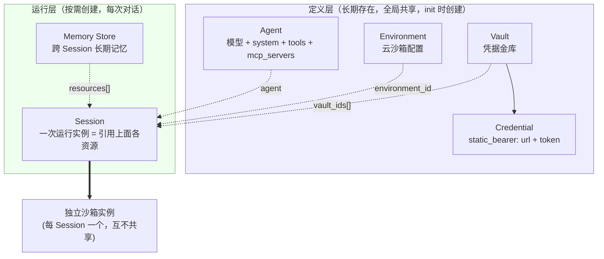
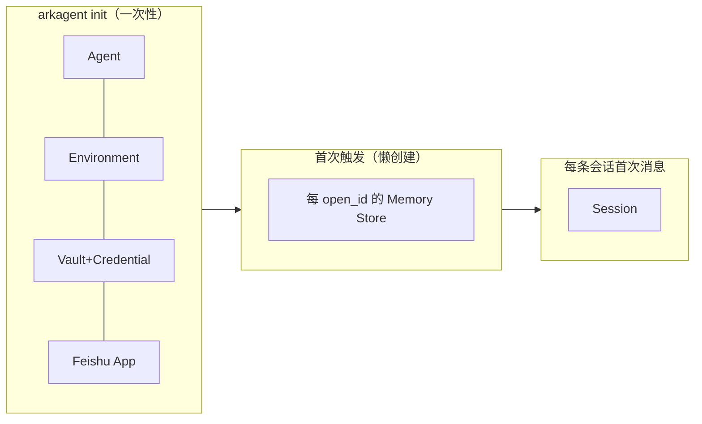

# 火山方舟 Managed Agents · 组件关系与生命周期

> 面向：交付 / 二次开发同学。本文是 MA 平台的**静态视角**——有哪些组件、各是什么、谁包含谁、谁绑定谁、何时创建 / 绑定 / 销毁。
> 想看「一条消息怎么流过这些组件」的**动态视角**，见 [四卡点数据流转说明](./MA迁移Demo-四卡点数据流转说明.md)。
> 每个组件先给**官方通用定义**（依据 [火山方舟 ManagedAgents 官方文档](./火山方舟_ManagedAgents_docs.md)），再附**本 demo 怎么用 + 代码链接**。
> 说明：文中结构图 / 关系图用 Mermaid 编写，在支持 Mermaid 的渲染器（Trae/IDE 预览、GitHub）中可直接看图；粘贴到飞书文档时图不渲染，请以图下方的文字表格为准。

---

## 0. 一句话地图

MA 把一个"能干活的 Agent 运行实例"拆成了**一组可独立创建、按需组合的资源**。它们不是层层继承的类，而是**在创建 Session 那一刻被拼装到一起**的积木：



**核心认知（三条，后面反复用到）**：

1. **Agent / Environment / Vault 都不互相绑定**——它们各自独立创建，只是各自的 ID 被写进配置。真正把它们凑到一起的，是 **Session**（通过 `agent` / `environment_id` / `vault_ids` / `resources` 四个字段引用）。
2. **凭据绑在 Session、不绑在 Agent**。所以同一个 Agent 的不同 Session 可以挂不同 Vault（这是 MA 支持"每终端用户各自凭据"的基础）。
3. **每个 Session 拿到的是独立沙箱实例**，Session 之间不共享文件系统状态。跨 Session 的持久化只能靠 Memory Store（或外部存储）。

---

## 1. 组件逐个拆解

下面每个组件的结构：**是什么（官方）→ 关键约束 → 本 demo 怎么用 + 代码**。

### 1.1 Agent（智能体定义）

**是什么**：一份**声明式定义**，规定这个 Agent 用哪个模型、system prompt 是什么、能用哪些工具（内置工具集 / MCP / Skills）。它是**模板**，不持有任何运行状态，也不含任何凭据明文。

**关键约束**：
- Agent 有**版本**。更新 Agent 会产生新版本；运行中的 Session **不能**改 Agent 配置，要调整能力得发布新版本再新建 Session（官方 Session 状态机一节明确"本期不支持运行时修改 Agent 配置 / tools / mcp_servers"）。
- Agent 定义里声明的 `mcp_servers[]` **只有 URL，没有 token**——token 在 Vault 里（见 1.3）。

**本 demo 怎么用**：init 时创建一个 Agent，配置由 [build_customer_a_agent_config](../arkagent/init.py#L59) 生成：`agent_toolset_20260701`（保留 bash/read/glob/grep，关掉 web_search/web_fetch）+ `mcp_toolset`（`permission_policy.type=always_allow`）+ `mcp_servers`（指向 mock 的 URL）+ system prompt [CUSTOMER_A_AGENT_SYSTEM](../arkagent/init.py#L25)。换 MCP 地址时通过 [update_agent](../arkagent/ark.py#L112) 发布新版本。

| | |
| --- | --- |
| 创建 | [create_agent](../arkagent/ark.py#L103)（init 阶段，[init.py:114](../arkagent/init.py#L114)） |
| 更新 | [update_agent](../arkagent/ark.py#L112)（`update-agent` 命令换地址 / 改配置时） |
| 存哪 | 方舟侧；ID 写进 config.env 的 `ARK_AGENT_ID` |

### 1.2 Environment（云环境 / 沙箱配置）

**是什么**：定义 Agent 运行所在**沙箱的配置**（类型 `cloud`、网络策略等）。注意它是"配置模板"，不是沙箱实例本身。

**关键约束**：
- `name` 在同一 project 内**必须唯一**，重名报 400。
- **多个 Session 可引用同一个 Environment，但每个 Session 获得独立沙箱实例**，Session 间不共享文件系统。
- Environment **不做版本化**；频繁改配置建议业务侧自己记录。
- 只有**没有 Session 引用**时才能删除。
- 网络策略：`networking.type=unrestricted` 完全放行（MCP 可用）；`limited` 才看 allow 列表。**本 demo 用 unrestricted**（否则 mock MCP 连不通）。

**本 demo 怎么用**：init 时创建一个 Environment，名字含 Agent ID + Feishu App ID（避免误复用旧应用的环境），见 [init.py:135-148](../arkagent/init.py#L135-L148)。

| | |
| --- | --- |
| 创建 | [create_environment](../arkagent/ark.py#L135)（init 阶段） |
| 存哪 | 方舟侧；ID 写进 config.env 的 `ARK_ENVIRONMENT_ID` |

### 1.3 Vault（凭据金库）与 Credential（凭据）

**是什么**：Vault 是**装凭据的容器**；Credential 是一条具体凭据。MA 支持三类凭据：`mcp_oauth`、`static_bearer`、`environment_variable`。本 demo 卡点 A 用 `static_bearer`。

一条 `static_bearer` 凭据的结构：

```text
Vault (display_name = customer-a-ma-<agentid>)
└── Credential
      auth.type            = static_bearer
      auth.mcp_server_url   = <MCP 地址>   ← 结构性字段，创建后锁定，用来「匹配该用哪条凭据」
      auth.token            = <Bearer 明文>  ← 加密保管，不回显
```

**关键约束（换址 401 的根因都在这）**：
- **`mcp_server_url` 在 Vault 内必须唯一**，且**创建后不可变**（结构性字段被锁定）。要改地址只能**删旧建新**，不能原地改。
- 每 Vault 最多 20 条凭据。
- **MCP 类凭据创建时会立即握手探测**目标 MCP（发 initialize），token 错 / 不可达会直接 4xx 失败——所以"建凭据成功"≈"方舟公网能连上且 token 对"。
- **运行时按 `mcp_server_url` 匹配**：Agent 要连某 MCP URL 时，在本 Session 挂的 Vault 里找 `mcp_server_url` 相等的凭据取 token；**没有匹配的就匿名连接**（服务器要鉴权就报错 → 这就是"换址后 401、日志显示 `auth=<缺失>`"的成因）。多个 Vault 都有匹配时第一个优先。
- 凭据在 Session 期间**周期性重新解析**，轮换 / 删除 / 刷新会传播到运行中的 Session，无需重启。

**本 demo 怎么用**：init 时建一个 Vault + 一条 `static_bearer` 凭据（token = `demo-bearer-token`），见 [init.py:118-133](../arkagent/init.py#L118-L133)。换址由 [update-agent --mcp-url](../arkagent/cli.py#L176-L230) 编排：**先用新址建新凭据（触发探测）→ 更新 Agent → 写回 .env → 按 URL 删掉所有非新址的旧凭据**（不按名字匹配，兼容历史异名凭据）。

| | |
| --- | --- |
| 创建 Vault | [create_vault](../arkagent/ark.py#L159)（init 阶段） |
| 创建凭据 | [create_static_bearer_credential](../arkagent/ark.py#L188)（创建即握手探测） |
| 删除凭据 | [delete_credential](../arkagent/ark.py#L200)（换址清理旧凭据） |
| 存哪 | 方舟侧；Vault ID 写进 config.env 的 `ARK_VAULT_ID`；token 同时写进 `MCP_STATIC_BEARER` |

> `MCP_STATIC_BEARER` 这一个值"一处配两处用"（mock 服务端校验 + 方舟客户端凭据），详见 [数据流转说明 §0.5](./MA迁移Demo-四卡点数据流转说明.md#05-关键机制深挖--凭证与-openid-的存储与传递)。

### 1.4 Session（会话 / 运行实例）

**是什么**：**一次实际运行**。创建 Session 时，通过字段把前面的定义层资源**引用**进来，方舟据此拉起一个独立沙箱、加载 Agent 定义、挂上凭据和记忆，然后开始处理事件。**Session 是所有组件真正被"拼装"到一起的地方。**

Session 创建时引用的四类东西：

| 字段 | 引用谁 | 本 demo 用途 |
| --- | --- | --- |
| `agent` | Agent ID | 用哪套模型 / prompt / 工具 |
| `environment_id` | Environment ID | 在哪种沙箱里跑 |
| `vault_ids[]` | Vault ID 列表 | **卡点 A**：给 MCP 调用提供 token |
| `resources[]` | Memory Store 等 | **卡点 D**：挂载长期记忆目录到 `/mnt/memory/` |
| `env_overrides` | （会话级环境变量） | **卡点 B**：注入 `FEISHU_USER_OPEN_ID` |

**关键约束**：
- **Session 状态机**：`idle`（等输入，启动即 idle）→ `running`（执行中）→ 回 `idle`；出临时错误进 `rescheduled` 自动重试；不可恢复错误进 `terminated`（记录保留但不再收事件）。
- **运行时不能改任何 Session 字段**（名称 / Agent 配置 / tools / mcp_servers / 权限策略都不行）。
- **每 Session 独立沙箱，互不共享文件系统**。
- 删除 Session 不可逆（`running` 状态需先中断回 `idle` 才能删）。
- `resources` 里的 **Memory Store 只能创建时挂载**，运行中不能增减。

**本 demo 怎么用**：每条会话首次消息时建 Session，见 [_create_session](../arkagent/gateway.py#L174-L187)——一次性把 B（env_overrides）、C（不在这，走 system_message）、D（resources）、A（vault_ids）需要的东西都注入。会话身份用四元组 `(tenant_key, chat_id, thread_id, user_open_id)` 隔离，session_id 存在应用侧 SQLite（见 1.6）。`/new` 只重置当前会话的 session 映射，下条消息重新建 Session。

| | |
| --- | --- |
| 创建 | [create_session](../arkagent/ark.py#L221)（每条会话首次消息，[gateway.py:181](../arkagent/gateway.py#L181)） |
| 驱动 | [run](../arkagent/ark.py#L269)（发 user.message + 收 SSE 事件流） |
| 存哪 | 方舟侧；session_id 映射存应用侧 SQLite `conversations` 表 |

### 1.5 Memory Store（跨 Session 长期记忆）

**是什么**：一个**跨 Session 保留**的记忆容器。挂到 Session 后以目录形式出现在沙箱 `/mnt/memory/` 下，Agent 用标准文件工具读取。**Agent 对它只读**——写入必须由应用侧调 API（这点决定了本 demo 的 `/remember` 设计）。

**关键约束**：
- **只能在创建 Session 时通过 `resources` 挂载**，运行中不能加减。
- 单个 Session 最多挂 10 个 Store；单个 Store 最多 2000 条 memory，单条 ≤ 100KB。
- **Agent 只读**，不能写 `/mnt/memory/`。
- 使用 Memory Store 要求 Agent 启用了 Agent Toolset（靠文件工具读取）。

**本 demo 怎么用（卡点 D）**：
- **每 open_id 一个专属 Store**（懒创建：首次建 Session 或 `/remember` 时创建，预置一条 `/profile/basic.md` 画像），见 [ensure_user_store](../arkagent/memory.py#L33-L52)。
- 写入走 `/remember` 显式指令 → 应用侧调 API 写一条时间戳命名的 note，见 [remember](../arkagent/memory.py#L54-L64) 和 [_handle_remember_command](../arkagent/gateway.py#L189-L209)。
- 建 Session 时把该用户 Store（可选 + 团队 Store）拼进 `resources`，见 [build_session_resources](../arkagent/memory.py#L78-L89)。
- 岗位调动 / `/new` **不新建 Store**，只是新开 Session 挂同一个 Store → 天然记得历史。

| | |
| --- | --- |
| 创建 Store | [create_memory_store](../arkagent/ark.py#L209)（懒创建） |
| 写记忆 | [create_memory](../arkagent/ark.py#L213)（应用侧写，Agent 只读） |
| 存哪 | 方舟侧；open_id→store_id 映射存应用侧 SQLite `memory_stores` 表 |

### 1.6 应用侧存储（不是 MA 组件，但关系图里少不了）

MA 本身不替你记"哪条飞书会话对应哪个 Session、哪个用户对应哪个 Store"这类**映射**，这些落在本 demo 的 SQLite（[GatewayStore](../arkagent/store.py)）里：

| 表 | 主键 | 存什么 | 服务于 |
| --- | --- | --- | --- |
| `conversations` | conversation_key（四元组） | → session_id / agent 版本 | Session 复用 / `/new` 重置 |
| `processed_events` | event_id | 已处理事件 | 消息去重 |
| `role_cache` | open_id | 岗位 + TTL | 卡点 C（软层岗位） |
| `memory_stores` | open_id | → memory_store_id | 卡点 D（用户记忆） |
| `team_stores` | role | → team_store_id | 卡点 D-3（团队共享） |

**对照记忆**：三种"要不要落库"的信息——① **凭据 token**：落方舟 Vault（不落应用库）；② **岗位 / Store 映射**：落应用侧 SQLite（要持久）；③ **OpenID**：**不落库**，每 Session 通过 `env_overrides` 现注入（详见数据流转说明的 OpenID 七跳表）。

---

## 2. 谁绑定谁 · 一张关系表

| 关系 | 绑定方式 | 绑定时机 | 说明 |
| --- | --- | --- | --- |
| Session → Agent | `agent` 字段 | 建 Session 时 | 引用，非包含；可固定版本 |
| Session → Environment | `environment_id` 字段 | 建 Session 时 | 多 Session 共享同一 Env，但各自独立沙箱 |
| Session → Vault | `vault_ids[]` 字段 | 建 Session 时 | **凭据绑 Session 不绑 Agent**；不同用户可挂不同 Vault |
| Session → Memory Store | `resources[]` 字段 | **仅建 Session 时** | 运行中不能加减 |
| Vault → Credential | 包含关系 | 建凭据时 | 一个 Vault 装多条凭据（≤20） |
| Credential ↔ MCP 地址 | `mcp_server_url` 匹配 | 运行时按 URL 匹配 | URL 不可变，改址=删旧建新 |
| Agent → MCP Server | `mcp_servers[]`（仅 URL） | 建 / 更新 Agent 时 | token 不在这，在 Vault |

**最容易记错的两条**：
- ❌ "凭据配在 Agent 上" → ✅ 凭据在 Vault、**运行时按 Session 挂的 vault_ids 生效**。
- ❌ "改一下凭据的 URL 就能换址" → ✅ URL 是锁定的结构性字段，**必须删旧建新**。

---

## 3. 生命周期 · 什么时候建、什么时候销

### 3.1 创建时机（三个阶段）



| 阶段 | 建了什么 | 代码 |
| --- | --- | --- |
| **init（一次性）** | Agent、Environment、Vault + Credential、Feishu App | [init.py `run_guided_init`](../arkagent/init.py#L98-L175) |
| **首次触发（懒创建）** | 每 open_id 一个 Memory Store（首次建 Session 或首次 `/remember`） | [ensure_user_store](../arkagent/memory.py#L33-L52) |
| **每条会话首次消息** | Session（绑齐 A/B/C/D 所需） | [_create_session](../arkagent/gateway.py#L174-L187) |

### 3.2 更新 / 变更时机

| 场景 | 影响的组件 | 怎么做 |
| --- | --- | --- |
| 换 MCP 地址（cpolar 重启） | Agent（新版本）+ Vault（删旧凭据建新）+ config.env | [update-agent --mcp-url](../arkagent/cli.py#L176-L230) 一条命令编排 |
| 改 Agent 能力 / prompt | Agent（新版本） | 发布新版本，已有 Session 不受影响，新 Session 才用新版 |
| 岗位调动（卡点 C） | 无 MA 组件变更 | 只更新应用侧 `role_cache`，下轮对话经 system_message 声明 |
| 记住一条信息（卡点 D） | Memory Store（+1 条 memory） | `/remember` → 应用侧写 API |

### 3.3 销毁 / 重置

| 操作 | 效果 | 约束 |
| --- | --- | --- |
| `/new` | 重置当前会话的 session 映射，下条消息重建 Session | 只影响这一条会话；Memory Store 不动，所以仍记得 |
| 删 Session | 永久移除 Session 记录 / 事件 / 沙箱 | 不可逆；`running` 需先中断回 idle |
| 删凭据 | 换址时清理旧凭据 | 周期性重解析会传播到运行中 Session |
| 删 Environment | 释放环境配置 | 仅当无 Session 引用时可删 |

---

## 4. 和四卡点的对应关系（速查）

| 卡点 | 主要涉及的组件 | 关键绑定字段 | 展开阅读 |
| --- | --- | --- | --- |
| **A** MCP 鉴权 | Vault + Credential(static_bearer) | Session.`vault_ids[]` | [数据流转说明 · 卡点 A](./MA迁移Demo-四卡点数据流转说明.md) |
| **B** 用户 OpenID 透传 | Session（会话级环境变量） | Session.`env_overrides` | [数据流转说明 · 卡点 B](./MA迁移Demo-四卡点数据流转说明.md) |
| **C** 岗位信息注入 | Agent（system_message）+ 应用侧 role_cache | run 时的 `system_message` | [数据流转说明 · 卡点 C](./MA迁移Demo-四卡点数据流转说明.md) |
| **D** 每用户长期记忆 | Memory Store | Session.`resources[]` | [数据流转说明 · 卡点 D](./MA迁移Demo-四卡点数据流转说明.md) |

---

## 附：术语与官方出处

| 组件 | 官方文档小节（见 [火山方舟_ManagedAgents_docs.md](./火山方舟_ManagedAgents_docs.md)） |
| --- | --- |
| Agent | 「创建 Agent」「Agent 定义字段」「更新 Agent 与版本」 |
| Environment | 「配置云环境」「环境生命周期」「管理环境」「云沙箱参考」 |
| Vault / Credential | 「使用 Vaults 认证」「添加凭据——三种类型」「凭据约束」「轮换凭据」「凭据生命周期」 |
| Session | 「启动 Session」「Session 状态机」「管理 Session」「Session 事件流」 |
| Memory Store | 「持久化记忆」「创建 Memory Store」「挂载 Memory Store 到 Session」「Agent 如何访问 Memory」 |
| MCP / Toolset | 「在 Agent 上声明 MCP Server」「在 Session 中注入 MCP 凭据」「配置工具集」 |
