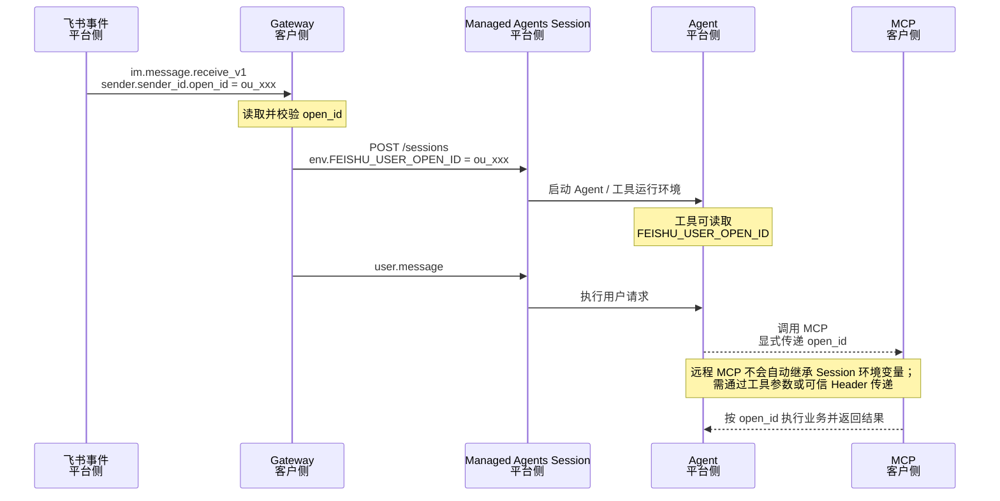

# open_id 流转时序

## 运行位置

| 实体 | 运行位置 |
|---|---|
| 飞书事件 | 飞书平台 |
| Gateway | 客户服务层 |
| Managed Agents Session | 火山方舟云 |
| Agent | 火山方舟云 |
| MCP | 客户服务层 |

## 核心边界

`open_id` 可以从飞书事件可靠到达 Gateway，并在创建 Session 时注入为 `FEISHU_USER_OPEN_ID`。远程 MCP 无法自动继承该环境变量，需要 Agent 通过工具参数或可信 Header 显式传递。
